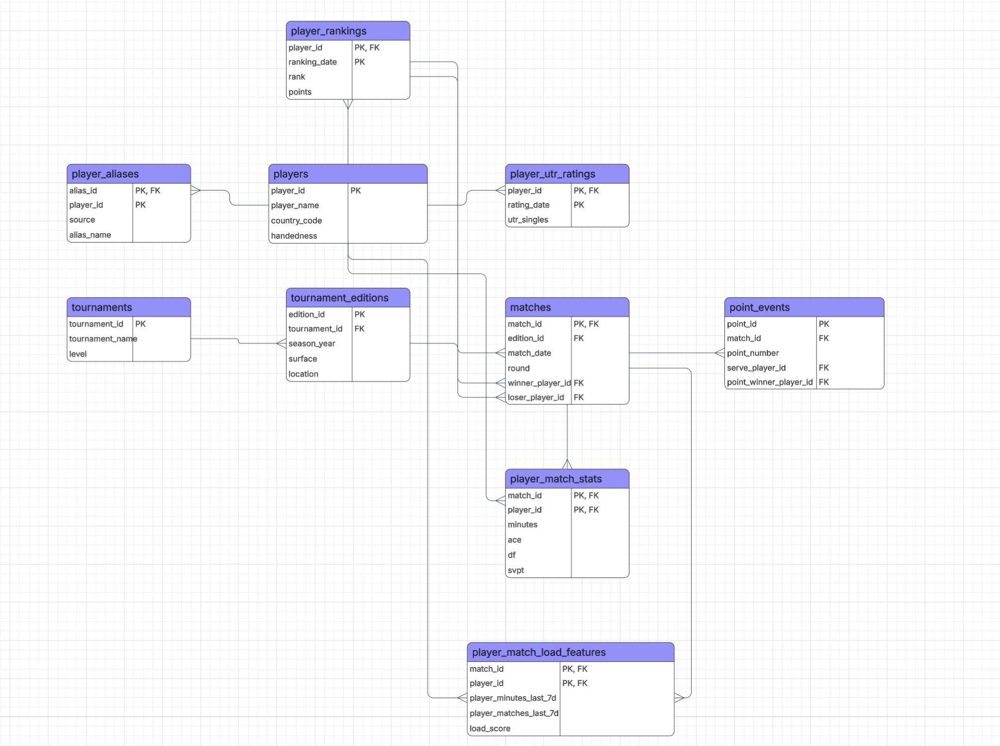

# DS 4320 Project 1: ATP Tennis Match Prediction with a Relational Database

## Executive Summary
This repository contains my DS 4320 Project 1 on predicting ATP men’s singles match outcomes using a relational dataset built from historical tennis records. The project includes data acquisition, relational modeling, DuckDB-based analysis, a machine learning pipeline, metadata documentation, a press release, and linked project data.

**Name:** Dylan Dietrich  
**NetID:** atv7xh  
**DOI:** [your DOI link]  
**Press Release:** [press_release.md](./press_release.md)  
**Data:** [data folder](./data/)  
**Pipeline:** [pipeline notebook](./notebooks/your_notebook.ipynb)  
**License:** [MIT License](./LICENSE)

## Problem Definition

### Initial General Problem and Refined Specific Problem Statement

**Initial general problem:** Predicting sports game outcomes.

**Refined specific problem:** This project focuses on predicting ATP men’s singles match outcomes. More specifically, it estimates the probability that Player 1 defeats Player 2 in a future ATP singles match using only pre-match information available before the match date, including player ranking history, prior match performance, tournament context, and recent workload features stored in a relational database.

### Rationale for the Refinement

I refined the general problem of predicting sports game outcomes into ATP men’s singles match prediction because first of all I know a lot about tennis and I am obsessed with it. Secondly, tennis provides a well-defined one-versus-one setting, a clear target variable, and publicly available historical match data. Narrowing the problem to ATP singles makes it possible to create a clean relational dataset with linked tables for players, matches, rankings, tournaments, and player-level match facts rather than trying to combine multiple sports with different structures. This refinement improves both the clarity of the project and the quality of the secondary dataset while still addressing a meaningful real-world prediction problem.

### Motivation for the Project

The motivation for this project is that I always feel like the tennis odds for the grandslam matches are off. I am always sure that the favorites should have a stronger edge and therefore higher precentage to win the match. Another thing is, tennis predictions are often discussed using isolated statistics such as ranking, recent form, or head-to-head records, but those pieces of information are usually scattered across different sources and are not organized into one consistent analytical system. By building a relational model, this project creates a reusable foundation for both querying and prediction. The goal is not only to estimate match outcomes more systematically and accurately, but also to show how a well-designed secondary dataset can transform raw sports records into a practical decision-support tool for analysts, and coaches.

### Press Release Headline and Link

**Headline:** *New Tennis Match Prediction System Uses Rankings, Form, and Workload to Estimate ATP Match Outcomes*  
**Link:** [press_release.md](./press_release.md)

---

## Domain Exposition

### Terminology

| Term | Meaning in this project | Why it matters |
|---|---|---|
| ATP | Association of Tennis Professionals | Governing tour for the men’s professional singles matches used in this project |
| Match outcome | Whether a player wins or loses a match | The target variable for the predictive model |
| Surface | Court type such as Hard, Clay, or Grass | Tennis performance can vary substantially by surface |
| Ranking | ATP player ranking at a given date | Captures a player’s relative standing in the sport |
| Ranking points | ATP ranking points | Adds more detail than rank alone |
| Elo | Rating system updated after each match | Tracks player strength dynamically over time |
| Recent form | Performance over recent matches | Helps capture short-term momentum |
| Workload | Recent match volume and minutes played | Helps estimate fatigue and recovery effects |
| UTR | Universal Tennis Rating | Optional rating source used as an additional player-strength signal |
| Relational model | Data organized into multiple linked tables | Core requirement of the project and foundation of analysis |
| DuckDB | Analytical database engine used in the pipeline | Used to load, query, and analyze the dataset |
| Feature | A variable used as input to the model | Examples include ranking gap, surface win rate gap, and Elo gap |
| Calibration | How well predicted probabilities match actual outcomes | Important because the project predicts probabilities, not just winners |

### Domain Paragraph

This project lives at the intersection of sports analytics, relational data engineering, and predictive modeling. Tennis is especially well suited for this kind of analysis because each match involves two players, a clearly observed result, and meaningful pre-match context such as ranking, surface, tournament level, recent match history, and workload. In practice, tennis analysis and statistics are often fragmented across websites, which makes it difficult to study matchups in a consistent way. This project addresses that issue by constructing a secondary dataset in the relational model and then using that dataset to support machine learning analysis for ATP men’s singles match prediction.

### Background Reading Folder

All background readings are stored in: [Background readings folder](./background%20readings/)

| Title | Brief description | Link to file |
|---|---|---|
| Jeff Sackmann ATP Tennis Data | Describes the historical ATP data source, including players, rankings, results, and match stats | [Jeff_sackmann_atp_repo](./background%20readings/jeff_sackmann_atp_repo.pdf) |
| ATP Rankings FAQ | Explains how ATP rankings work and why they are important in tennis | `background_readings/atp_rankings_faq.pdf` |
| An Introduction to Tennis Elo | Introduces Elo ratings and why they may be useful for tennis forecasting | `background_readings/tennis_elo_intro.pdf` |
| Analysis and Forecasting of Tennis Matches | Academic research on statistical modeling of tennis outcomes | `background_readings/tennis_forecasting_paper.pdf` |
| Match Charting Project | Overview of detailed point-by-point tennis data for advanced analysis | `background_readings/match_charting_project.pdf` |

---
## Data Creation

### Raw Data Acquisition / Provenance

The core raw data for this project comes from the Jeff Sackmann `tennis_atp` dataset, which provides historical ATP men’s singles match records across seasons. These files serve as the base source for players, match outcomes, tournament information, and basic match statistics. I use those raw files to construct a secondary dataset organized in the relational model.

In addition to the ATP historical files, the project supports optional enrichment from ranking history, UTR rating history, tournament location data, and point-by-point or live update sources (when it was possible). These additional sources are not all required for the base version of the project, but they allow the database to support richer feature engineering such as workload, travel, and player timeline analysis. The final project dataset is therefore not a direct copy of one source. It is a secondary dataset built by cleaning, joining, and normalizing multiple tennis-related sources into a consistent relational structure.

### Code Used to Create the Data

| File | Purpose | Link |
|---|---|---|
| `scripts/run_tennis_database_pipeline.py` | Main database build and refresh pipeline | [run_tennis_database_pipeline.py](./scripts/run_tennis_database_pipeline.py) |
| `src/tennis_model/database.py` | Defines the database schema and table logic | [database.py](./src/tennis_model/database.py) |
| `scripts/update_atp_main_data.py` | Refreshes ATP raw match data files | [update_atp_main_data.py](./scripts/update_atp_main_data.py) |
| `scripts/build_live_state.py` | Creates refreshed player state and match history artifacts | [build_live_state.py](./scripts/build_live_state.py) |
| `scripts/train_model.py` | Builds features and trains the prediction model | [train_model.py](./scripts/train_model.py) |
| `notebooks/project1_pipeline.ipynb` | Jupyter notebook showing the end-to-end pipeline | [project1_pipeline.ipynb](./notebooks/project1_pipeline.ipynb) |

### Bias Identification

Bias can enter this dataset in several ways. First, public ATP data reflects only recorded professional matches and may underrepresent lower-level competitive context, injuries, or hidden variables such as health and coaching changes. Second, optional sources such as UTR history or live point-by-point feeds may have uneven coverage across players, tournaments, or seasons. Third, historical data quality can vary across years, meaning that some features may be more complete for recent matches than for older ones.

### Rationale for Critical Decisions and Uncertainty

Several important design decisions shaped this project. First, I used a relational schema rather than one denormalized file because tennis data naturally contains linked entities such as players, matches, tournaments, rankings, and point events. Second, I restricted the modeling problem to ATP men’s singles so the target variable and data structure would remain consistent. Third, I engineered only pre-match features so the model would reflect realistic prediction conditions. Finally, I documented uncertainty using missingness and summary statistics for numerical variables, since player-level sports data can vary in completeness, especially for optional sources such as UTR and point-by-point feeds.

---

## Metadata

### Schema

Logical ER diagram:

### Data Table

Due to GitHub file size limits, the exported CSV files are stored in OneDrive.

| Table | Description | Link |
|---|---|---|
| `players` | Master player table containing player identity and latest profile fields | [players.csv](https://myuva-my.sharepoint.com/:x:/r/personal/atv7xh_virginia_edu/Documents/Data/players.csv?d=w166da6ed03d6406393f9a9152195ae3f&csf=1&web=1&e=iinbSS) |
| `player_rankings` | Historical ATP ranking records by player and ranking date | [player_rankings.csv](https://myuva-my.sharepoint.com/:x:/r/personal/atv7xh_virginia_edu/Documents/Data/player_rankings.csv?d=w4f24bbe7b6874cbba0d489ec1db7068c&csf=1&web=1&e=hQkG89) |
| `player_utr_ratings` | Historical UTR ratings by player and date | [player_utr_ratings.csv](https://myuva-my.sharepoint.com/:x:/r/personal/atv7xh_virginia_edu/Documents/Data/player_utr_ratings.csv?d=we50e49c940b24aa994c586a19e283e7a&csf=1&web=1&e=PvISYi) |
| `player_aliases` | Cross-source player identity mapping table | [player_aliases.csv](https://myuva-my.sharepoint.com/:x:/r/personal/atv7xh_virginia_edu/Documents/Data/player_aliases.csv?d=w2c204b60e7f440e08fecd3bbbf8939af&csf=1&web=1&e=XCY2hq) |
| `tournaments` | Canonical tournament dimension table | [tournaments.csv](https://myuva-my.sharepoint.com/:x:/r/personal/atv7xh_virginia_edu/Documents/Data/tournaments.csv?d=w62d95f16882c458e880fd52b62e4cba4&csf=1&web=1&e=HcuvJd) |
| `tournament_editions` | Tournament season/year editions with location and surface context | [tournament_editions.csv](https://myuva-my.sharepoint.com/:x:/r/personal/atv7xh_virginia_edu/Documents/Data/tournament_editions.csv?d=w24b5ddcd269843e1a52b720f0f0b5618&csf=1&web=1&e=DOTD1j) |
| `matches` | Match fact table containing match-level context and identifiers | [matches.csv](https://myuva-my.sharepoint.com/:x:/r/personal/atv7xh_virginia_edu/Documents/Data/matches.csv?d=wf46824e3851f4b56965303d1b6e027fe&csf=1&web=1&e=LWt3vP) |
| `player_match_stats` | Per-player match-level statistics derived from historical matches | [player_match_stats.csv](https://myuva-my.sharepoint.com/:x:/r/personal/atv7xh_virginia_edu/Documents/Data/player_match_stats.csv?d=w87f7e5a393f2434f9ab82bed6cd58925&csf=1&web=1&e=nRuUPp) |
| `player_match_load_features` | Per-player rolling workload and travel feature table | [player_match_load_features.csv](https://myuva-my.sharepoint.com/:x:/r/personal/atv7xh_virginia_edu/Documents/Data/player_match_load_features.csv?d=wa00050f0e61e470eb79faacc6252660d&csf=1&web=1&e=63sRF4) |
| `point_events` | Point-by-point event table for supported match sources | [point_events.csv](https://myuva-my.sharepoint.com/:x:/r/personal/atv7xh_virginia_edu/Documents/Data/point_events.csv?d=w95647d52f764438ea35ba5ddb3f10712&csf=1&web=1&e=Dfl5zy) |

### Data Dictionary

| Feature Name | Data Type | Description | Example |
|---|---|---|---|
| `player_id` | integer / string key | Unique identifier for a player | `104745` |
| `full_name` | string | Player’s full name | `Carlos Alcaraz` |
| `ranking_date` | date | Date of ATP ranking observation | `2025-01-13` |
| `rank` | integer | ATP ranking position | `3` |
| `points` | integer | ATP ranking points | `7010` |
| `match_id` | string | Unique identifier for a match | `miami_2025_r32_alcaraz_dimitrov` |
| `match_date` | date | Date of the match | `2025-03-24` |
| `surface` | string | Court surface | `Hard` |
| `best_of` | integer | Match length format | `3` |
| `is_winner` | integer / boolean | Whether the player won the match | `1` |
| `ace` | integer | Number of aces served by the player in the match | `9` |
| `df` | integer | Number of double faults | `2` |
| `svpt` | integer | Total service points played | `63` |
| `first_in` | integer | First serves landed in | `40` |
| `first_won` | integer | First-serve points won | `31` |
| `second_won` | integer | Second-serve points won | `14` |
| `minutes` | integer | Match duration in minutes | `98` |
| `player_minutes_last_7d` | float | Minutes played by the player over the previous 7 days | `312.0` |
| `player_matches_last_7d` | integer | Number of matches played over the previous 7 days | `4` |
| `load_score` | float | Composite workload feature derived from recent load components | `2.47` |
| `utr_singles` | float | UTR singles rating when available | `16.12` |
| `round` | string | Tournament round | `QF` |
| `tourney_level` | string | Tournament level | `M` |

### Quantification of Uncertainty for Numerical Features

| Numerical Feature | Missing % | Mean | Std. Dev. | Min | 25th % | Median | 75th % | Max | Notes on uncertainty |
|---|---:|---:|---:|---:|---:|---:|---:|---:|---|
| `rank` | 0.00 | 846.10 | 525.55 | 1.00 | 402.00 | 813.00 | 1252.00 | 2271.00 | Rank varies over time and may be missing for some older rows |
| `points` | 11.42 | 117.40 | 431.61 | 1.00 | 2.00 | 11.00 | 68.00 | 16950.00 | Rankings points are date-dependent and can shift quickly |
| `minutes` | 50.59 | 104.61 | 39.80 | 0.00 | 76.00 | 97.00 | 126.00 | 1146.00 | Match duration can vary widely by round, format, and competitiveness |
| `ace` | 49.04 | 5.73 | 5.09 | 0.00 | 2.00 | 4.00 | 8.00 | 113.00 | Some data sources may have incomplete stat coverage |
| `df` | 49.04 | 3.08 | 2.52 | 0.00 | 1.00 | 3.00 | 4.00 | 26.00 | Distribution may be right-skewed |
| `svpt` | 49.04 | 79.55 | 29.45 | 0.00 | 58.00 | 74.00 | 96.00 | 491.00 | Depends on match length and serving patterns |
| `player_minutes_last_7d` | 0.00 | 84.40 | 154.51 | 0.00 | 0.00 | 0.00 | 119.00 | 1605.00 | Workload depends on schedule density and may be zero after long breaks |
| `player_matches_last_7d` | 0.00 | 1.64 | 1.82 | 0.00 | 0.00 | 1.00 | 3.00 | 19.00 | Discrete count feature with non-normal distribution |
| `load_score` | 0.00 | 30.17 | 54.50 | 0.00 | 0.00 | 0.70 | 42.12 | 564.20 | Engineered feature sensitive to weighting choices |
| `utr_singles` | 0.00 | 12.50 | 5.03 | 0.00 | 13.71 | 14.37 | 14.87 | 16.26 | Optional source with incomplete historical coverage |

---

## Repository Organization

| Folder / File | Purpose |
|---|---|
| `README.md` | Project overview and documentation |
| `press_release.md` | Separate press release aimed at nontechnical readers |
| `background_reading/` | Background articles and supporting readings |
| `data/` | Project data artifacts and templates |
| `notebooks/` | Jupyter notebook pipeline and markdown export |
| `scripts/` | Reproducible pipeline and modeling scripts |
| `src/` | Source code for the database and feature logic |
| `images/` | ER diagram and publication-quality charts |
| `LICENSE` | License file |

---

## Data Storage

The project dataset is constructed using the relational model and contains more than four linked tables. Data are stored as CSV and/or parquet exports in a UVA OneDrive folder linked from this README. Core relational entities include players, rankings, tournaments, tournament editions, matches, player-level match statistics, workload features, and point-by-point events.

---

