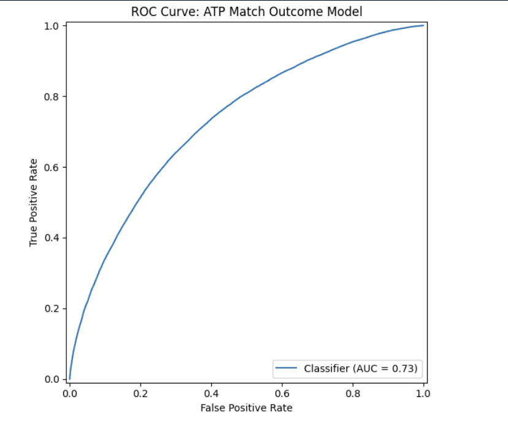

# Press Release

## Headline

**Relational Tennis Database Improves ATP Match Prediction by Combining Rankings, Workload, and Match Context**

## Hook

Predicting tennis matches is difficult because outcomes depend on more than just a player’s overall ranking. Recent form, workload, tournament context, and opponent strength all matter. This project builds a relational tennis database and uses machine learning to combine these factors into a more structured match prediction pipeline.

## Problem Statement

Tennis data is often scattered across separate files and sources, making it difficult to build a clean analytical workflow. Rankings, player metadata, match results, workload features, and point-level information are all useful, but they are much more powerful when they are organized into connected relational tables. The central problem of this project is to create a database that integrates these sources and supports predictive modeling for ATP men’s singles match outcomes.

A second challenge is that tennis match prediction is inherently uncertain. Even strong players lose, rankings change over time, and recent fatigue or schedule congestion can affect performance in ways that are not obvious from simple summary statistics. Because of this, a good solution must not only collect the data, but also structure it in a way that supports meaningful pre-match feature engineering.

## Solution Description

This project creates a relational database from ATP tennis data and related feature tables. The database includes player information, ranking history, UTR ratings, tournament editions, match records, player-level match statistics, rolling workload features, and point-level event data. These tables are linked through shared identifiers so that they can be queried efficiently in DuckDB. Keep in mind that not all these features are used right now to predcit the matches because it was hard to get historical- UTR rnakings and -point by point data. These features are currently getting scrapped everyday and uploaded into the database so that in the near feature we will be able to also use them to train the model. 

Using SQL, I prepared a modeling dataset that combines:
- player and opponent rankings
- player and opponent ranking points
- recent workload measures such as minutes played and matches played in the last 7 days
- tournament context such as surface, event level, and best-of format

I then trained a logistic regression model to predict whether a player wins a match. This serves as an interpretable baseline model and demonstrates that the database structure supports an end-to-end predictive workflow. On the held-out test set, the model achieved an accuracy of about **0.67** and an ROC AUC of about **0.73**, showing that the pipeline captures meaningful predictive signal above random guessing.

## Why It Matters

This project shows that relational modeling makes sports analytics more usable and more reproducible. Instead of working from disconnected spreadsheets or raw files, analysts can query a consistent database and generate features in a transparent way. That makes it easier to explore performance patterns, train predictive models, and extend the system later with additional features such as surface-specific form, head-to-head history, or point-by-point trends.

More broadly, this project demonstrates how database design and machine learning can work together. The value is not only in the final predictive model, but also in the structure that makes future analysis possible.

## Chart

The key visualization for this project is the ROC curve from the binary classification model.

## Closing Statement

By organizing ATP tennis data into a relational database and using it to engineer pre-match predictive features, this project creates a strong foundation for match prediction and future tennis analytics work. The result is both a functioning predictive pipeline and a reusable data system that supports deeper analysis going forward.
